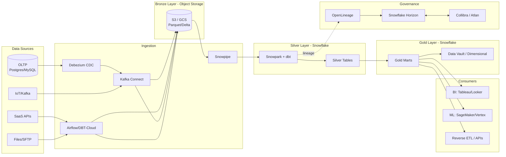
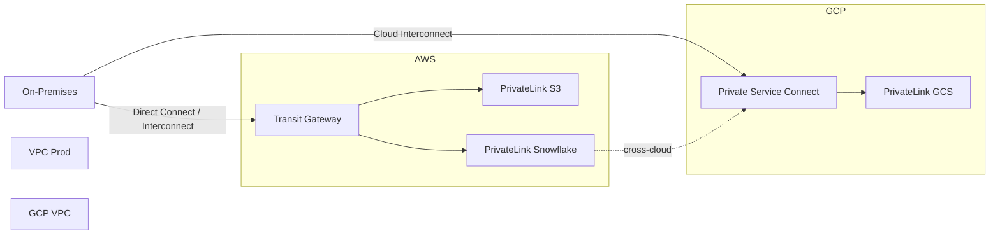
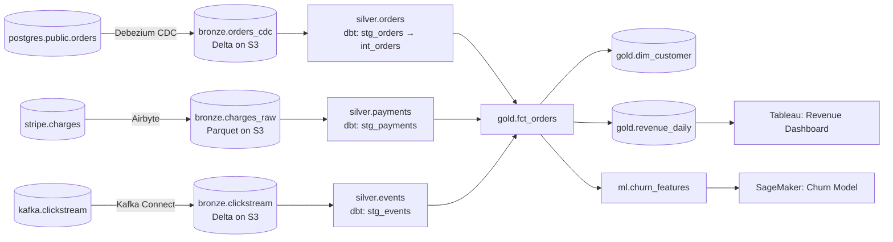

# Architecture Design Document — Hybrid Medallion Lakehouse

## 1. Executive Summary

The Hybrid Medallion Lakehouse unifies object storage (S3/GCS) with a cloud-native warehouse (Snowflake) under a Bronze–Silver–Gold paradigm, ingesting raw events via batch, micro-batch, CDC, and APIs. Terraform codifies the entire infrastructure-as-code, while dbt + Snowpark own Silver/Gold transformations with tested lineage. Snowflake Horizon Catalog provides a system-of-record for governance, federated with Collibra/Atlan for enterprise stewardship, and OpenLineage emits a unified lineage graph across all producers and consumers. The target state is a multi-cloud, LGPD-compliant, low-latency platform that serves BI, ML, and operational analytics from a single trusted semantic layer.

## 2. Architectural Principles

1. **Lakehouse convergence** — one copy of data in open formats (Parquet/Delta/Iceberg) consumed by both warehouse engines and ML frameworks.
2. **Schema-on-read for Bronze, schema-on-write for Gold** — preserve raw fidelity upstream; enforce contracts at consumption.
3. **Infrastructure-as-code only** — no console-provisioned resources; all changes flow through Git + Terraform + CI.
4. **Separation of storage and compute** — independent scaling of Bronze (object storage) and Silver/Gold (Snowflake warehouses).
5. **Governance by design** — cataloging, lineage, masking, and retention are first-class pipeline concerns, not afterthoughts.
6. **Hybrid by default** — workloads cross S3↔GCS↔Snowflake via PrivateLink; no public egress in steady state.

## 3. Architecture Overview

## 4. Data Flow por Camada

| Camada | Localização | Formato | Transformação | Retenção | Acesso |
|---|---|---|---|---|---|
| **Bronze** | S3 / GCS (`s3://lake/bronze/`) | Parquet/Delta, partitioned by `event_date` | Schema capture only, type coercion minimal | 90 dias hot, 7 anos Glacier | Ingest services + Snowflake `EXTERNAL TABLE` |
| **Silver** | Snowflake `RAW.SILVER` | Snowflake native + Iceberg tables | dbt models: dedup, conform types, SCD2, late-arriving handling | 2 anos | Warehouse + read-optimized via Secure Views |
| **Gold** | Snowflake `ANALYTICS.GOLD` | Star schema / Data Vault 2.0 | dbt: business logic, KPIs, aggregations, ML features | Indefinida, com `TIME_TRAVEL` 90d | BI tools, ML platforms, Reverse ETL via API |
| **Semantic** | Snowflake `ANALYTICS.SEMANTIC` | dbt metrics + Semantic Layer | Shared dimensions, certified metrics | Indefinida | BI/Notebooks |

## 5. Technology Stack

| Componente | Tecnologia | Propósito |
|---|---|---|
| Object Storage | AWS S3 + GCS (multi-cloud) | Bronze layer, raw landing zone |
| Warehouse | Snowflake (AWS + GCP) | Silver/Gold compute + storage |
| Transformation | dbt-core + dbt-snowflake + Snowpark | SQL + Python transformations, tests, docs |
| IaC | Terraform + GitHub Actions | Provisionamento de contas, roles, DBs, networks |
| Catalog | Snowflake Horizon Catalog | System-of-record, tags, masking policies |
| Enterprise Catalog | Collibra / Atlan | Stewardship, business glossary, workflows |
| Lineage | OpenLineage + Marquez | Cross-platform lineage events |
| Ingestion CDC | Debezium + Kafka Connect | Log-based CDC from OLTP |
| Streaming | Apache Kafka (MSK / Confluent) | Event backbone for CDC + IoT |
| Orchestration | Airflow 2.x / Dagster | DAGs, dependencies, retries, sensors |
| Observability | Monte Carlo / Datafold + Prometheus + Grafana | Data quality + platform SLOs |
| CI/CD | GitHub Actions + pre-commit + tflint | Lint, plan, deploy |

## 6. Integration Patterns

| Pattern | Latency | Tecnologia | Caso de uso |
|---|---|---|---|
| **Batch** | Hourly / Daily | Airflow + Snowflake `COPY INTO` | Backfills, monthly closes |
| **Micro-batch** | 1–5 min | Snowpipe (auto-ingest SQS/GCS Pub/Sub) | File drops, near-real-time files |
| **CDC** | Segundos | Debezium → Kafka → Snowpipe Streaming | OLTP replication (orders, customers) |
| **Streaming** | Sub-segundo | Kafka → Snowflake Kafka Connector / Snowpipe Streaming | Clickstream, IoT telemetry |
| **API / SaaS** | Scheduled / Webhook | Airbyte / Fivetran / custom Python → S3 | Salesforce, Stripe, HRIS |

Todos os connectors publicam eventos **OpenLineage** (`START`, `COMPLETE`, `FAIL`) com `job`, `inputs`, `outputs`.

## 7. Security & Governance

- **Autenticação**: SSO via Okta + SCIM provisioning; Snowflake `SAML_SSO`; AWS IAM Identity Center.
- **Autorização (RBAC)**: Snowflake role hierarchy `SYSADMIN → SECURITYADMIN → domain roles (ANALYST_BI, DS_ML, INGEST_SVC)`. Separação `USAGE` vs `OWNERSHIP` em todos os schemas.
- **Criptografia**: at-rest KMS (CMK por ambiente dev/stg/prd), em-transit TLS 1.3, tri-Secret (Snowflake) para dados altamente sensíveis.
- **LGPD/Compliance**: data classification tags (PII, SPI, CONFIDENCIAL) no Horizon; row-access policies por tenant; consentimento versionado em Silver.
- **Masking**: Dynamic Data Masking + External Tokenization (Collibra/Protegrity) para CPF, e-mail, telefone.
- **Auditoria**: Snowflake `ACCESS_HISTORY` + CloudTrail + S3 access logs → Lake centralizado em `s3://lake-audit/` com retenção 7 anos.
- **Network**: Zero public egress; PrivateLink para todas as integrações; bucket policies com `aws:SourceVpce`.

## 8. Networking

- **AWS↔GCP**: peering via Snowflake organization replication + cross-cloud table shares.
- **On-prem↔Cloud**: AWS Direct Connect + GCP Partner Interconnect com BGP.
- **DNS**: Route 53 + Cloud DNS resolvers privados; sufixo `lake.internal`.

## 9. DR & Resilience

| Recurso | RTO | RPO | Mecanismo |
|---|---|---|---|
| Bronze (S3) | 4 h | 0 | Cross-Region Replication (CRR) + Object Lock |
| Snowflake Silver/Gold | 1 h | 5 min | Snowflake **Database Replication** (failover groups) + `TIME_TRAVEL` 90d |
| Metadata (Horizon) | 15 min | 0 | Replicação automática entre contas |
| Terraform state | 5 min | 0 | S3 backend versionado + DynamoDB lock, multi-region |
| Catálogo (Collibra) | 4 h | 15 min | Active-active entre regiões |

DR runbook anual; **chaos drills** trimestrais para Kafka e Snowflake.

## 10. Cost Optimization

- **Auto-suspend** 60s em todos os warehouses; **auto-resume** em queries agendadas; warehouses `X-Small` por padrão.
- **Resource Monitors** com alertas em 80% / hard cap em 100% do budget mensal por account/team.
- **S3 Storage Classes**: Intelligent-Tiering para Bronze, Standard-IA para Silver exports, Glacier Instant Retrieval após 90 dias.
- **Snowflake**: Credit quotas por account, tag-based cost allocation via Horizon, separação de warehouses `ingest`, `transform`, `bi`, `ml`.
- **dbt**: build incremental com `merge` strategy; `materialized='incremental'` em todas as tabelas >100M rows; nightly full-refresh apenas em Gold pequeno.
- **Reserved/Committed**: Snowflake 3-year commitment para baseline 60% do uso.
- **Forecast**: FinOps dashboard (Grafana) com breakdown por team/schema/job.

## 11. Architecture Decision Records

### ADR-001 — Delta Lake vs Parquet para Bronze

**Contexto.** Bronze precisa suportar schema evolution (campos novos chegam diariamente), upserts de CDC Debezium, e leitura eficiente por Snowflake (Parquet nativo) e Spark/ML. Parquet puro oferece melhor compatibilidade, mas exige schema-on-write manual.

**Decisão.** Adotar **Delta Lake** no Bronze quando o producer é CDC ou exige ACID; manter **Parquet particionado** quando o source é append-only (logs, arquivos) e o consumer é Snowpipe.

**Consequências.**
- (+) ACID, time-travel, schema evolution automática, OPTIMIZE/Z-ORDER.
- (+) Snowflake lê Delta via `EXTERNAL TABLE` + Iceberg REST catalog compat.
- (−) +15% custo de storage por `_delta_log/`.
- (−) Necessário glue/catalog service (Unity ou Polaris).

### ADR-002 — dbt vs SQL puro para transformações Silver/Gold

**Contexto.** Equipe possui 12 desenvolvedores SQL, 3 Python engineers. Necessidade de testes automatizados, lineage, documentation e CI/CD.

**Decisão.** **dbt-core + dbt-snowflake** como engine padrão para Silver/Gold; **Snowpark Python** para casos com lógica complexa (feature engineering ML, UDFs, NLP).

**Consequências.**
- (+) Tests (`not_null`, `unique`, `relationships`), docs, exposures, lineage automático.
- (+) CI com `dbt build --select state:modified+` reduz tempo de execução em PRs.
- (−) Curva de aprendizado em Jinja + macros.
- (−) dbt não substitui orquestração; mantemos Airflow para cross-domain.

### ADR-003 — Snowflake Horizon Catalog vs Collibra

**Contexto.** Snowflake Horizon entrega catalog, governance, masking e lineage nativamente. Collibra/Atlan fornece stewardship de negócio, workflows, glossário e integração com sistemas legados.

**Decisão.** **Snowflake Horizon** como system-of-record técnico (tags, policies, lineage). **Collibra** como camada de stewardship/business glossary com federação bidirecional via Horizon Catalog API.

**Consequências.**
- (+) Um único ponto de aplicação de políticas (Horizon).
- (+) Collibra preservado para governança de negócio já existente.
- (−) Sync lag 5–15 min entre Horizon ↔ Collibra.
- (−) Duplicação inicial de metadata; processo de reconciliação necessário.

## 12. Linhagem de Exemplo

