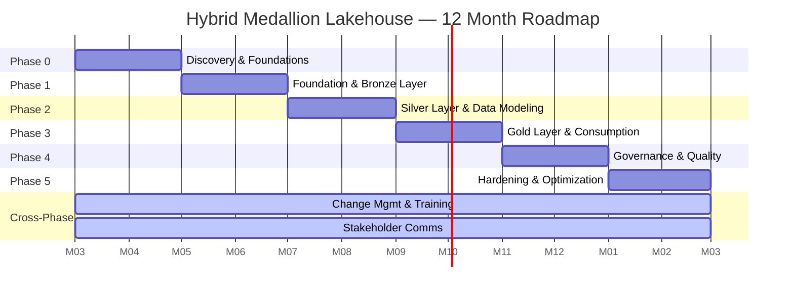

# Hybrid Medallion Lakehouse — Implementation Roadmap

**Version:** 1.0
**Last Updated:** September 2026
**Duration:** 12 months (M0–M12)
**Status:** Approved for execution

---

## 1. Roadmap Overview

### 1.1 Executive Summary

This roadmap delivers a greenfield Hybrid Medallion Lakehouse combining Snowflake (compute + governance), object storage (S3/GCS) as the open storage layer, dbt for transformation, Snowpark for advanced workloads, Terraform for IaC, and a unified catalog (Horizon / Collibra / Atlan). The program is structured into six phases over 12 months, with explicit go/no-go gates between phases and a continuous workstream for change management, training, and stakeholder communication.

### 1.2 Phase Timeline (Gantt)

### 1.3 Phase Summary Table

| Phase | Months | Theme | Primary Outcome | Gate |
|-------|--------|-------|-----------------|------|
| 0 | M0–M1 | Discovery & Foundations | Approved target architecture, business case, pilot scope | G0 |
| 1 | M2–M3 | Foundation & Bronze Layer | Raw zone operational with 2–3 pilot sources landing | G1 |
| 2 | M4–M5 | Silver Layer & Data Modeling | Conformed, tested Silver models for pilot domain | G2 |
| 3 | M6–M7 | Gold Layer & Consumption | Domain marts consumed by BI (Power BI / Tableau) | G3 |
| 4 | M8–M9 | Governance & Quality at Scale | Catalog, lineage, LGPD, quality SLAs enforced | G4 |
| 5 | M10–M11 | Hardening & Optimization | Production SLA, cost targets met, handover complete | G5 |

---

## 2. Phase 0 — Discovery & Foundations (M0–M1)

### 2.1 Objectives

- Validate business case and quantify value at stake
- Confirm target architecture and technology selections
- Lock pilot scope, success metrics, and data sources
- Establish governance model, RACI, and security baseline
- Secure executive sponsorship and budget envelope

### 2.2 Deliverables

| # | Deliverable | Owner | Format |
|---|-------------|-------|--------|
| D0.1 | Business case & value model (TAM/SAM, KPIs, payback) | PM + Architect | Document |
| D0.2 | Target architecture document (HLD) | Architect | Document + diagrams |
| D0.3 | Pilot scope statement (2–3 sources, 1–2 domains) | PM + Stakeholder | Document |
| D0.4 | RACI matrix and governance model | Governance Analyst | Document |
| D0.5 | Security & compliance baseline (LGPD, ISO 27001 mapping) | Governance Analyst | Document |
| D0.6 | Cloud provider agreement & Snowflake license procurement | PM + Procurement | Contracts |
| D0.7 | Source system access provisioning plan | Data Engineers | Document |
| D0.8 | Reference architecture decision records (ADRs) | Architect | Repo |

### 2.3 Exit Criteria

- [ ] Executive sponsor sign-off on business case and budget
- [ ] Snowflake organization created; cloud provider MSA active
- [ ] At least 2 pilot source systems identified with access plan
- [ ] RACI and governance model approved by steering committee
- [ ] Architecture decision records (ADRs) merged for storage, compute, catalog, IaC
- [ ] Phase 1 plan baselined with assigned owners

### 2.4 Team & Allocation

| Role | Allocation (FTE) | Focus |
|------|------------------|-------|
| PM | 1.0 | Planning, stakeholder mgmt, business case |
| Architect | 0.8 | HLD, ADRs, vendor evaluation |
| Data Engineers | 2.0 | Source reconnaissance, access setup |
| Governance Analyst | 0.5 | Compliance baseline, RACI |
| Business Stakeholder | 0.3 | Scope validation, sponsor alignment |

### 2.5 Risks

| Risk | Likelihood | Impact | Mitigation |
|------|------------|--------|------------|
| Snowflake licensing negotiation delays | Medium | High | Pre-engage account team M-1; secure LOI |
| Source system access blocked by legacy owners | High | High | Executive sponsorship; legal/security review in M1 |
| Scope creep on pilot selection | Medium | Medium | Lock 2–3 sources only; defer others to backlog |
| Misalignment on catalog vendor | Medium | Medium | Run vendor bake-off; default to Atlan if no consensus |

---

## 3. Phase 1 — Foundation & Bronze Layer (M2–M3)

### 3.1 Objectives

- Stand up Snowflake, object storage, and Terraform-based IaC
- Implement raw landing zone (Bronze) with Snowpipe for pilot sources
- Configure observability, secrets management, and CI/CD foundation
- Wire up minimal catalog metadata extraction

### 3.2 Deliverables

| # | Deliverable | Owner | Format |
|---|-------------|-------|--------|
| D1.1 | Terraform monorepo with dev/stg/prod workspaces | Architect | Code |
| D1.2 | Snowflake account, warehouses, roles, network policies | Architect + DE | Code + runbook |
| D1.3 | S3/GCS buckets with lifecycle, versioning, KMS encryption | Architect | Code |
| D1.4 | Snowpipe for 2–3 pilot sources (CDC where applicable) | Data Engineers | Code + runbook |
| D1.5 | Bronze schema conventions, naming standards, file formats | Architect | Document |
| D1.6 | CI/CD pipelines (Terraform Cloud/GitHub Actions, dbt Cloud) | DE | Code |
| D1.7 | Observability stack (logs, cost, query history) | DE | Dashboard |
| D1.8 | Minimal catalog ingestion (Horizon/Collibra/Atlan) | Governance Analyst | Configuration |

### 3.3 Exit Criteria

- [ ] IaC provisions a full dev environment in <30 min
- [ ] Snowpipe ingesting from all pilot sources with monitored lag
- [ ] Bronze tables conform to schema + partitioning standards
- [ ] Cost dashboard live with per-warehouse and per-pipeline visibility
- [ ] Catalog shows 100% of Bronze tables with owner and tags
- [ ] Disaster recovery tested (Time Travel + object storage replication)

### 3.4 Team & Allocation

| Role | Allocation (FTE) | Focus |
|------|------------------|-------|
| PM | 1.0 | Phase coordination, risk mgmt |
| Architect | 0.8 | IaC patterns, security |
| Data Engineers | 3.0 | Pipelines, Snowpipe, integration |
| Governance Analyst | 0.4 | Catalog wiring, tagging |

### 3.5 Risks

| Risk | Likelihood | Impact | Mitigation |
|------|------------|--------|------------|
| Snowpipe cost overrun on small files | High | Medium | Auto-suspend, file size targets, aggregations |
| Cloud egress charges surprise | Medium | Medium | Pin regions, monitor daily, alert thresholds |
| Terraform state management collisions | Medium | High | Remote backend with locking, branch policies |
| Source schema drift breaks Snowpipe | High | High | Schema registry, alerts on load failures |

---

## 4. Phase 2 — Silver Layer & Data Modeling (M4–M5)

### 4.1 Objectives

- Implement dbt-based Silver layer with conformed dimensions and facts
- Introduce data contracts between producers (Bronze) and consumers (Silver/Gold)
- Standardize data quality testing and entity resolution
- Enable collaborative development workflows

### 4.2 Deliverables

| # | Deliverable | Owner | Format |
|---|-------------|-------|--------|
| D2.1 | dbt project with staging, intermediate, marts layers | Data Engineers | Code |
| D2.2 | Data contracts for top 10 critical datasets | Architect + DE | Document + repo |
| D2.3 | Standardized testing suite (unique, not_null, relationships, freshness) | DE | Code |
| D2.4 | Entity resolution framework (customer, product, transaction) | DE + Architect | Code + doc |
| D2.5 | Conformed dimension models (customer, product, date, geography) | DE | Code |
| D2.6 | CI for dbt (slim CI, model contracts, exposures) | DE | Code |
| D2.7 | Semantic versioning for models and ownership | Governance Analyst | Document |
| D2.8 | Catalog auto-population from dbt manifests | Governance Analyst | Configuration |

### 4.3 Exit Criteria

- [ ] All pilot Silver models passing dbt tests with >95% coverage
- [ ] Data contracts published and versioned; producers signed off
- [ ] Entity resolution working for top 2 entity types with measurable match rate
- [ ] dbt documentation site published with lineage diagrams
- [ ] Source-to-Silver freshness SLA defined and monitored (<24h for batch, <15min for CDC)
- [ ] Catalog shows dbt models with descriptions, owners, column-level lineage

### 4.4 Team & Allocation

| Role | Allocation (FTE) | Focus |
|------|------------------|-------|
| PM | 1.0 | Phase coordination |
| Architect | 0.6 | Data contracts, modeling patterns |
| Data Engineers | 3.0 | dbt, modeling, tests |
| Governance Analyst | 0.4 | Contracts, catalog |

### 4.5 Risks

| Risk | Likelihood | Impact | Mitigation |
|------|------------|--------|------------|
| Source teams reject data contract obligations | Medium | High | Executive sponsorship; lightweight contract template |
| Entity resolution accuracy below threshold | High | High | Iterative tuning; human-in-the-loop sampling |
| dbt model proliferation / sprawl | Medium | Medium | Ownership tags; ownership required for new domains |
| Late-arriving data breaks aggregates | High | Medium | Late-arriving handling patterns; reconciliation dashboards |

---

## 5. Phase 3 — Gold Layer & Consumption (M6–M7)

### 5.1 Objectives

- Build domain-aligned Gold marts (dimensional and Data Vault variants where justified)
- Expose certified data via Snowflake views and APIs
- Integrate with Power BI / Tableau and establish semantic layer
- Validate end-to-end SLAs from source to consumption

### 5.2 Deliverables

| # | Deliverable | Owner | Format |
|---|-------------|-------|--------|
| D3.1 | Gold dimensional models for priority domains (sales, finance, customer) | Data Engineers | Code |
| D3.2 | Aggregated / pre-computed metric tables | DE | Code |
| D3.3 | Snowflake views / REST API for BI consumers | DE | Code |
| D3.4 | Power BI / Tableau certified datasets & semantic model | DE + Analyst | Workbook |
| D3.5 | Consumption SLAs (latency, freshness, availability) | Architect | Document |
| D3.6 | Reverse-ETL evaluation (Hightouch / Census) if in scope | Architect | Document |
| D3.7 | End-user enablement kits (data dictionary, how-to guides) | Governance Analyst | Repo |
| D3.8 | BI performance benchmarks (query time, concurrency) | DE | Report |

### 5.3 Exit Criteria

- [ ] Gold marts cover 100% of priority domain requirements
- [ ] BI dashboards migrated or built fresh on certified Gold datasets
- [ ] Consumption SLAs met for 4 consecutive weeks
- [ ] API endpoints tested with auth, rate limiting, and SLA monitoring
- [ ] Semantic layer versioned with change-log and stakeholder review
- [ ] End-user satisfaction survey >4.0/5.0 from pilot business unit

### 5.4 Team & Allocation

| Role | Allocation (FTE) | Focus |
|------|------------------|-------|
| PM | 1.0 | Phase coordination, business reviews |
| Architect | 0.5 | SLAs, semantic layer |
| Data Engineers | 3.0 | Gold models, API, BI integration |
| Governance Analyst | 0.3 | Documentation, enablement |
| Business Stakeholder | 0.5 | UAT, acceptance |

### 5.5 Risks

| Risk | Likelihood | Impact | Mitigation |
|------|------------|--------|------------|
| BI tools over-fetch and exceed Snowflake cost budget | High | High | Result cache, query result limits, certified datasets |
| Conflicting metric definitions across domains | Medium | High | Semantic layer governance; metric certification board |
| Gold models diverge from Silver contracts | Medium | Medium | dbt exposures; lineage alerts |
| Late business UAT delays phase exit | Medium | Medium | Early UAT in M6; weekly demos |

---

## 6. Phase 4 — Governance & Quality at Scale (M8–M9)

### 6.1 Objectives

- Operationalize enterprise-grade data governance
- Implement quality frameworks (Great Expectations / DQX)
- Enforce LGPD, masking policies, row-level access
- Mature catalog to full lineage and business glossary adoption

### 6.2 Deliverables

| # | Deliverable | Owner | Format |
|---|-------------|-------|--------|
| D4.1 | Data quality framework (Great Expectations / DQX) | DE + Governance | Code + runbook |
| D4.2 | LGPD compliance program (legal basis, DPIA, retention) | Governance Analyst | Document |
| D4.3 | Snowflake masking policies + row access policies | Architect + Governance | Code |
| D4.4 | Catalog maturity (glossary, domains, stewardship, SLA tags) | Governance Analyst | Configuration |
| D4.5 | Column-level lineage end-to-end | DE + Architect | Configuration |
| D4.6 | Quality SLAs and alerting (per-tier freshness, completeness, accuracy) | DE | Dashboard |
| D4.7 | Data access request workflow (catalog → ticketing) | Governance Analyst | Workflow |
| D4.8 | PII inventory and pseudonymization strategy | Governance Analyst | Document |

### 6.3 Exit Criteria

- [ ] 100% of PII columns tagged and masked in non-privileged roles
- [ ] Column-level lineage available for all Gold and Silver models
- [ ] Data quality SLAs enforced with breach alerting to owners
- [ ] LGPD DPIA signed by legal & DPO
- [ ] Catalog adoption: 100% of marts owned and reviewed quarterly
- [ ] Audit log retention and access review process operational

### 6.4 Team & Allocation

| Role | Allocation (FTE) | Focus |
|------|------------------|-------|
| PM | 0.8 | Phase coordination, compliance |
| Architect | 0.4 | Masking, lineage architecture |
| Data Engineers | 2.0 | Quality framework, alerts |
| Governance Analyst | 1.0 | LGPD, catalog, stewardship |
| Legal/DPO | 0.2 | DPIA, policy review |

### 6.5 Risks

| Risk | Likelihood | Impact | Mitigation |
|------|------------|--------|------------|
| Masking policies break downstream consumers | Medium | High | Staged rollout; consumer testing matrix |
| LGPD requires data minimization redesign | Medium | High | Legal review in M8; pseudonymization ready |
| Catalog fatigue / low adoption | High | Medium | Mandatory ownership; quarterly reviews with KPI |
| Quality framework false positives cause alert fatigue | Medium | Medium | Tiered thresholds; owner sign-off on alerts |

---

## 7. Phase 5 — Hardening & Optimization (M10–M12)

### 7.1 Objectives

- Tune performance and cost across all layers
- Implement disaster recovery and business continuity
- Produce operational runbooks and handover documentation
- Stabilize the platform under production load

### 7.2 Deliverables

| # | Deliverable | Owner | Format |
|---|-------------|-------|--------|
| D5.1 | Performance baselines & tuning report (query, warehouse, Snowpark) | Architect + DE | Document |
| D5.2 | Cost optimization playbook (auto-suspend, scaling, resource monitors) | Architect | Document |
| D5.3 | Disaster recovery plan (RPO/RTO, failover drills) | Architect | Document + drill |
| D5.4 | Operational runbooks (incident, capacity, security) | DE | Repo |
| D5.5 | On-call rotation and incident management integration (PagerDuty / ServiceNow) | DE | Configuration |
| D5.6 | Knowledge transfer & operational handover to ops team | PM + Architect | Workshops |
| D5.7 | Platform health dashboard (cost, quality, reliability) | DE | Dashboard |
| D5.8 | Post-implementation review and 12-month roadmap refresh | PM | Document |

### 7.3 Exit Criteria

- [ ] Cost per TB scanned and per Gold query reduced by ≥30% vs baseline
- [ ] DR drill executed successfully; RPO ≤ 1h, RTO ≤ 4h
- [ ] All runbooks tested via tabletop exercise
- [ ] Operations team owns on-call; engineering shadow week completed
- [ ] Platform health dashboard live with SLOs and error budgets
- [ ] Formal handover signed off by sponsor, ops, and governance

### 7.4 Team & Allocation

| Role | Allocation (FTE) | Focus |
|------|------------------|-------|
| PM | 0.6 | Handover, retrospective |
| Architect | 0.4 | DR, optimization, handover |
| Data Engineers | 2.0 | Tuning, runbooks, DR drill |
| Governance Analyst | 0.3 | Final governance posture |
| Ops Team | 1.0 | Knowledge transfer recipients |

### 7.5 Risks

| Risk | Likelihood | Impact | Mitigation |
|------|------------|--------|------------|
| Cost optimizations regress performance | Medium | Medium | A/B test changes; SLO guards |
| Ops team not ready to absorb platform | Medium | High | 4-week shadow; runbook dry runs |
| DR drill reveals gaps late | Medium | High | Mid-phase tabletop; full drill in M11 |
| Scope additions delay exit | High | Medium | Hard freeze in M11; backlog-only after |

---

## 8. Cross-Phase Workstreams

### 8.1 Change Management

| Activity | Phase(s) | Owner | Output |
|----------|----------|-------|--------|
| Stakeholder map & sponsor coalition | P0 | PM | Stakeholder register |
| Communication plan & cadence | P0–P5 | PM | Plan + status reports |
| Resistance assessment per domain | P2–P3 | PM | Risk log |
| Champions network in business units | P3–P4 | PM | Champions roster |
| Adoption metrics & surveys | P3–P5 | PM | Scorecards |

### 8.2 Training & Enablement

| Audience | Content | Cadence | Owner |
|----------|---------|---------|-------|
| Data Engineers | Snowflake, dbt, Snowpark, Terraform deep dives | M2, M4 | Architect |
| Analysts / BI devs | Gold marts, semantic layer, catalog usage | M7, M9 | Governance Analyst |
| Business users | Self-service analytics, data literacy | M7, ongoing | PM |
| Ops / SRE | Runbooks, on-call, DR | M11 | Architect |
| Governance stewards | Catalog stewardship, contracts | M5, M8 | Governance Analyst |

### 8.3 Stakeholder Communication

| Forum | Frequency | Audience | Purpose |
|-------|-----------|----------|---------|
| Steering committee | Monthly | Execs, sponsors | Decisions, funding, risks |
| Working group | Weekly | Core team | Execution, blockers |
| Demo day | End of each phase | Business + IT | Show progress, gather feedback |
| Newsletter | Bi-weekly | Org-wide | Wins, milestones, how-tos |
| Office hours | Weekly (P3+) | Analysts, business users | Q&A and adoption |

---

## 9. Dependencies

### 9.1 Critical Dependencies (Must Be Cleared Before Phase 1)

| Dependency | Owner | Required By | Status Gate |
|------------|-------|-------------|-------------|
| Snowflake enterprise contract signed | Procurement + PM | Start of P1 | G0 |
| Cloud provider (AWS/GCP) enterprise agreement active | Procurement + Architect | Start of P1 | G0 |
| Source system read access for 2–3 pilot sources | Source owners + DE | End of P1 | G1 |
| Network connectivity (private link / VPN) approved | Security + Architect | End of P1 | G1 |
| Catalog vendor selection finalized (Horizon/Collibra/Atlan) | Governance Analyst + Architect | End of P0 | G0 |
| Data classification policy approved | Governance Analyst + Legal | Start of P2 | G1 |
| DPO and LGPD advisor engaged | Legal | Start of P4 | G3 |

### 9.2 External / Soft Dependencies

| Dependency | Risk if Delayed | Mitigation |
|------------|-----------------|------------|
| Legacy DW retirement funding decisions | Delays Phase 5 handover | Decouple platform adoption from decommission |
| BI tool licensing (Power BI / Tableau capacity) | Constrains Phase 3 demos | Start renewal conversations in M5 |
| Identity provider integration (SSO/SAML) | Blocks RBAC rollout | Provision in parallel during P1 |
| Ticketing system (ServiceNow / Jira) | Blocks operational handover | Confirm during P0; default to Jira if contested |
| Data lake legacy cleanup windows | Slows Silver onboarding | Schedule in M3 with source owners |

---

## 10. Resource Plan

### 10.1 Allocation Matrix (FTE by Phase)

| Role | P0 | P1 | P2 | P3 | P4 | P5 |
|------|----|----|----|----|----|----|
| PM | 1.0 | 1.0 | 1.0 | 1.0 | 0.8 | 0.6 |
| Architect | 0.8 | 0.8 | 0.6 | 0.5 | 0.4 | 0.4 |
| Data Engineer (Senior) | 1.0 | 1.5 | 1.5 | 1.5 | 1.0 | 1.0 |
| Data Engineer (Mid) | 1.0 | 1.5 | 1.5 | 1.5 | 1.0 | 1.0 |
| Governance Analyst | 0.5 | 0.4 | 0.4 | 0.3 | 1.0 | 0.3 |
| Business Stakeholder | 0.3 | 0.3 | 0.3 | 0.5 | 0.3 | 0.2 |
| Legal / DPO | — | — | — | — | 0.2 | — |
| Ops Team (handover) | — | — | — | — | — | 1.0 |
| **Total FTE** | **3.6** | **4.5** | **4.3** | **4.3** | **3.7** | **3.5** |

### 10.2 Skill Coverage Matrix

| Skill | Owner Coverage | Backup |
|-------|----------------|--------|
| Snowflake / Snowpark | Architect + Senior DE | Mid DE |
| dbt | Senior DE | Mid DE |
| Terraform | Architect | Senior DE |
| Object storage (S3/GCS) | Architect | DE |
| Catalog (Atlan/Collibra/Horizon) | Governance Analyst | Architect |
| Power BI / Tableau | DE + Analyst | External vendor |
| LGPD / Compliance | Governance Analyst + Legal | External counsel |
| Incident / SRE | Architect (until handover) | Ops Team |

### 10.3 Hiring & Contracting Plan

- **In-house:** Core roles (PM, Architect, DEs, Governance) — confirmed by M0
- **Contractors:** Snowflake specialist, dbt expert, BI developer (M6–M9)
- **Vendors:** Catalog platform, cloud provider support, training partner
- **Advisory:** LGPD/DPO consultant, security architect (part-time through program)

---

## 11. Go / No-Go Criteria

### 11.1 Gate G0 — Phase 0 → Phase 1

- [ ] Executive sponsor approval of business case and 12-month budget
- [ ] Snowflake contract executed; cloud provider MSA active
- [ ] At least 2 pilot source systems with confirmed read access
- [ ] Architecture decisions documented (storage, compute, IaC, catalog)
- [ ] RACI matrix signed by all domain heads
- [ ] Phase 1 team confirmed and onboarded

### 11.2 Gate G1 — Phase 1 → Phase 2

- [ ] IaC provisions dev/stg/prod from scratch in <30 min
- [ ] Snowpipe ingesting from all pilot sources with monitored lag
- [ ] Bronze schema and naming standards published and enforced
- [ ] Cost dashboard live with per-pipeline visibility and alerts
- [ ] DR test (Bronze) passed with documented RPO/RTO

### 11.3 Gate G2 — Phase 2 → Phase 3

- [ ] All Silver models passing dbt tests with >95% coverage
- [ ] Top 10 data contracts signed by source and consumer owners
- [ ] Catalog auto-populated from dbt with descriptions and owners
- [ ] Source-to-Silver freshness SLA met for 2 consecutive weeks

### 11.4 Gate G3 — Phase 3 → Phase 4

- [ ] Gold marts cover 100% of priority domain requirements
- [ ] BI dashboards certified and consuming from Gold
- [ ] Consumption SLAs met for 4 consecutive weeks
- [ ] End-user satisfaction >4.0/5.0 in pilot business unit

### 11.5 Gate G4 — Phase 4 → Phase 5

- [ ] 100% of PII columns tagged, classified, and masked for non-privileged roles
- [ ] Column-level lineage available for Silver and Gold
- [ ] LGPD DPIA signed by Legal/DPO
- [ ] Data quality SLAs enforced with alerts routed to owners

### 11.6 Gate G5 — Phase 5 → Operational Handover

- [ ] Cost per TB scanned and per Gold query reduced ≥30% vs baseline
- [ ] DR drill passed with RPO ≤1h, RTO ≤4h
- [ ] All runbooks tested via tabletop exercise
- [ ] Operations team owns on-call after 1 week shadow
- [ ] Sponsor, ops, and governance sign formal handover

---

## 12. Appendix — Definition of Done by Phase

### 12.1 Phase 0 — DoD

- [ ] Business case signed
- [ ] HLD and ADRs merged
- [ ] Pilot scope frozen
- [ ] RACI signed
- [ ] Compliance baseline approved
- [ ] Vendor agreements executed

### 12.2 Phase 1 — DoD

- [ ] IaC repo in production
- [ ] Snowflake + storage provisioned in dev/stg/prod
- [ ] Snowpipe live for all pilot sources
- [ ] Observability stack operational
- [ ] Catalog shows Bronze tables
- [ ] DR test passed

### 12.3 Phase 2 — DoD

- [ ] dbt project with staging/intermediate/marts deployed
- [ ] Data contracts published and versioned
- [ ] dbt test coverage >95% on Silver
- [ ] Conformed dimensions live
- [ ] dbt docs site published
- [ ] Source-to-Silver freshness SLA monitored

### 12.4 Phase 3 — DoD

- [ ] Gold marts for priority domains in production
- [ ] BI dashboards certified on Gold
- [ ] API endpoints live with auth and rate limits
- [ ] Consumption SLAs met for 4 weeks
- [ ] End-user enablement kits published
- [ ] Pilot business unit sign-off

### 12.5 Phase 4 — DoD

- [ ] Quality framework live with tiered SLAs
- [ ] LGPD DPIA signed
- [ ] Masking + row-access policies in production
- [ ] Column-level lineage on Silver + Gold
- [ ] Catalog maturity targets met
- [ ] Audit and access review process live

### 12.6 Phase 5 — DoD

- [ ] Performance and cost targets met
- [ ] DR plan and drill report
- [ ] Runbooks tested and published
- [ ] On-call rotation live
- [ ] Health dashboard live with SLOs
- [ ] Formal handover signed
- [ ] Post-implementation review delivered

---

**Document owner:** Program Manager, Hybrid Medallion Lakehouse
**Next review:** End of Phase 0
**Approval required from:** Executive Sponsor, CIO, Data Governance Lead
