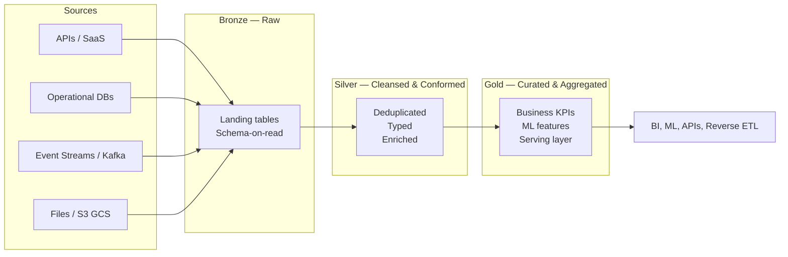

# Hybrid Medallion Lakehouse

> Unified, governed, and cloud-agnostic data platform that turns raw multi-source data into trusted, analytics-ready assets through a Bronze–Silver–Gold architecture on Snowflake.


## Table of Contents

- [Overview](#overview)
- [Architecture at a Glance](#architecture-at-a-glance)
- [Tech Stack](#tech-stack)
- [Repository Structure](#repository-structure)
- [Quick Start](#quick-start)
- [Documentation Index](#documentation-index)
- [Governance & Compliance](#governance--compliance)
- [Contributing](#contributing)
- [Team & Contacts](#team--contacts)
- [License](#license)

## Overview

The **Hybrid Medallion Lakehouse** is a modern data platform designed to ingest, transform, and serve data at scale by combining the flexibility of a data lake with the performance and governance of a cloud data warehouse. Built around the **Medallion Architecture (Bronze → Silver → Gold)**, the platform progressively refines raw data into trusted, business-ready datasets, enabling analytics, ML, and operational reporting from a single source of truth.

It is engineered to be **hybrid by design**: storage tiers span object storage (S3/GCS) and Snowflake-managed tables, while compute leverages Snowflake elastic engines, Snowpark for Python/Java workloads, and dbt for SQL transformations. This separation enables cost-efficient raw storage, reproducible transformations, and reliable serving of curated data to BI tools, APIs, and downstream consumers, all under a unified governance and observability framework.

## Architecture at a Glance



## Tech Stack

| Layer            | Technology                                     | Purpose                                            |
|------------------|------------------------------------------------|----------------------------------------------------|
| Storage          | AWS S3 / GCS                                   | Raw landing zone and external tables               |
| Warehouse        | Snowflake                                      | Compute, governance, Bronze/Silver/Gold tables     |
| Transformation   | dbt Core / dbt Cloud                           | Versioned SQL models, tests, documentation          |
| Custom Compute   | Snowpark (Python / Java / Scala)               | UDFs, stored procedures, complex ML workloads      |
| Ingestion        | Snowpipe, Kafka Connect, API Connectors        | Streaming and batch data ingestion                 |
| Orchestration    | Apache Airflow, Snowflake Tasks               | Pipeline scheduling and dependency management      |
| IaC              | Terraform                                      | Provisioning of Snowflake, S3, and networking      |
| Data Quality     | Great Expectations, dbt tests, Data Contracts  | Validation, anomaly detection, contract enforcement|
| CI/CD            | GitHub Actions, Azure DevOps                   | Automated build, test, and deploy pipelines        |
| Observability    | Grafana / Snowflake Account Usage, custom alerts | Monitoring, lineage, cost and freshness tracking   |
| Governance       | Snowflake Horizon Catalog + Collibra/Atlan, data contracts | Access control, lineage, PII and LGPD compliance   |

## Repository Structure

```
Hybrid Medallion Lakehouse/
├── 01-project-charter.md            # Mission, scope, sponsors, success metrics
├── 02-architecture-design.md        # Target architecture and design decisions
├── 03-implementation-roadmap.md      # Phased delivery plan and milestones
├── 04-data-governance-framework.md  # Policies, ownership, lineage, LGPD controls
├── 05-risks-and-compliance.md       # Risk register and compliance posture
├── README.md                        # This document
│
├── docs/                            # Long-form documentation and references
│   ├── architecture/                # Diagrams and Architecture Decision Records
│   │   ├── diagrams/                # C4, ERD, lineage and flow diagrams
│   │   └── adr/                     # Numbered Architecture Decision Records
│   ├── governance/                  # Governance artifacts and taxonomies
│   │   ├── policies/                # Access, retention, masking, classification
│   │   ├── glossary/                # Business and technical terms
│   │   └── data-dictionary/         # Canonical definitions of datasets and fields
│   ├── runbooks/                    # Operational procedures and incident playbooks
│   └── changelog/                   # Versioned release and change notes
│
├── src/                             # Source code and infrastructure definitions
│   ├── terraform/                   # Infrastructure-as-Code root module
│   │   ├── modules/                 # Reusable Terraform modules
│   │   │   ├── snowflake/           # Warehouses, roles, grants, databases
│   │   │   ├── s3/                  # Buckets, lifecycle, IAM policies
│   │   │   └── networking/          # VPC, subnets, security groups
│   │   └── environments/            # Per-env variable sets and state wiring
│   │       ├── dev/                 # Development environment
│   │       ├── stg/                 # Staging environment
│   │       └── prd/                 # Production environment
│   ├── dbt/                         # dbt project for all transformations
│   │   ├── models/                  # Bronze, Silver, and Gold models
│   │   │   ├── bronze/              # Raw landing models
│   │   │   ├── silver/              # Cleansed and conformed models
│   │   │   └── gold/                # Curated business and serving models
│   │   ├── macros/                  # Reusable dbt macros and helpers
│   │   ├── tests/                   # Singular and generic data tests
│   │   ├── seeds/                   # Reference and lookup data
│   │   └── snapshots/               # SCD type 2 tracking
│   ├── snowpark/                    # Snowpark workloads
│   │   ├── jobs/                    # Batch Snowpark jobs
│   │   └── udfs/                    # User-defined functions and procedures
│   └── ingestion/                   # Data ingestion entry points
│       ├── snowpipe/                # Snowpipe definitions and file formats
│       ├── kafka-connect/           # Kafka Connect connector configs
│       └── api-connectors/          # Custom API ingestion scripts
│
├── pipelines/                       # Delivery pipelines and orchestration
│   ├── ci-cd/                       # Continuous integration and deployment
│   │   ├── github-actions/          # GitHub Actions workflows
│   │   └── azure-devops/            # Azure DevOps pipelines
│   └── orchestration/               # Workflow orchestration definitions
│       ├── airflow-dags/            # DAG definitions and operators
│       └── snowflake-tasks/         # Native Snowflake task graphs
│
├── data-quality/                    # Data quality tooling and contracts
│   ├── great-expectations/          # GE suites and expectations
│   ├── dqx/                         # Lightweight in-pipeline checks
│   └── contracts/                   # Producer/consumer data contracts
│
├── observability/                   # Monitoring and dashboards
│   ├── dashboards/                  # Grafana / BI dashboard definitions
│   └── alerts/                      # Alert rules and notification policies
│
├── scripts/                         # Operational utilities
│   ├── bootstrap/                   # Environment bootstrap scripts
│   └── utilities/                   # Maintenance and helper scripts
│
└── .github/                         # GitHub configuration
    └── ISSUE_TEMPLATE/              # Standardized issue templates
```

## Quick Start

The following steps bring up the **dev** environment from scratch.

1. **Clone the repository**
   ```bash
   git clone <repository-url>
   cd "Hybrid Medallion Lakehouse"
   ```

2. **Configure credentials** — export Snowflake and cloud provider credentials as environment variables, or use a secrets manager.

3. **Provision infrastructure with Terraform**
   ```bash
   cd src/terraform/environments/dev
   terraform init
   terraform plan -out=tfplan
   terraform apply tfplan
   ```

4. **Install dbt dependencies and run models**
   ```bash
   cd src/dbt
   dbt deps
   dbt run --target dev
   dbt test --target dev
   ```

5. **Validate end-to-end** — trigger an orchestration DAG and inspect the observability dashboards.

For detailed operational steps, see `docs/runbooks/`.

## Documentation Index

| # | Document                                  | Purpose                                          |
|---|-------------------------------------------|--------------------------------------------------|
| 01 | [Project Charter](01-project-charter.md)                  | Scope, objectives, sponsors, success metrics     |
| 02 | [Architecture Design](02-architecture-design.md)          | Target architecture and design rationale          |
| 03 | [Implementation Roadmap](03-implementation-roadmap.md)    | Phased delivery plan and milestones             |
| 04 | [Data Governance Framework](04-data-governance-framework.md) | Policies, ownership, lineage, compliance      |
| 05 | [Risks & Compliance](05-risks-and-compliance.md)          | Risk register, mitigations, compliance posture   |

## Governance & Compliance

The platform enforces a layered governance model covering access control, data classification, lineage, retention, and quality. Sensitive data is masked and tagged at the source, and all datasets follow documented **data contracts** between producers and consumers.

The full governance model is documented in [`04-data-governance-framework.md`](04-data-governance-framework.md). The platform is designed to comply with **LGPD** (Lei Geral de Proteção de Dados) and equivalent privacy regulations, including purpose limitation, data minimization, access logging, and the right to erasure.

## Contributing

Contributions follow a lightweight, review-driven workflow:

- **Branching** — create a topic branch from `main` using the pattern `feat/<scope>`, `fix/<scope>`, `chore/<scope>`, or `docs/<scope>`.
- **Commits** — use [Conventional Commits](https://www.conventionalcommits.org/) (`feat:`, `fix:`, `docs:`, `refactor:`, `test:`, `chore:`).
- **Pull Requests** — open a PR against `main`, fill in the template, link the related issue, and request at least one reviewer from the owning team.
- **Code Review** — reviewers check correctness, performance, security, and adherence to governance and quality standards.
- **CI Checks** — Terraform plan, dbt build, data quality tests, and secret scanning must pass before merge.
- **Documentation** — update the relevant doc under `docs/` or the numbered charter documents when behavior, scope, or architecture changes.

## Team & Contacts

| Role               | Owner                | Contact                |
|--------------------|----------------------|------------------------|
| Tech Lead          | _TBD_                | _tech-lead@example.com_ |
| Data Governance    | _TBD_                | _governance@example.com_ |
| Product Manager    | _TBD_                | _product@example.com_  |

## License

_License to be defined._ Until a license is selected, all rights are reserved by the project owners.