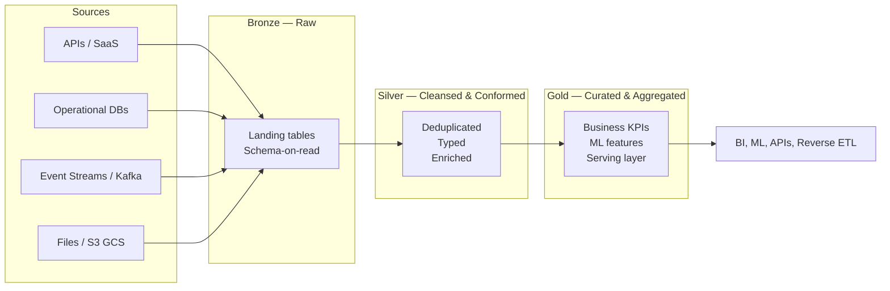

# Hybrid Medallion Lakehouse

> Unified, governed, and cloud-agnostic data platform that turns raw multi-source data into trusted, analytics-ready assets through a Bronze–Silver–Gold architecture on Snowflake.


## Table of Contents

- [Overview](#overview)
- [Cost-Conscious Architecture](#cost-conscious-architecture)
- [Quick Start (Local — R$0)](#quick-start-local--r0)
- [Architecture at a Glance](#architecture-at-a-glance)
- [Tech Stack](#tech-stack)
- [Repository Structure](#repository-structure)
- [Environments](#environments)
- [Documentation Index](#documentation-index)
- [Governance & Compliance](#governance--compliance)
- [Contributing](#contributing)

## Overview

The **Hybrid Medallion Lakehouse** is a modern data platform designed to ingest, transform, and serve data at scale by combining the flexibility of a data lake with the performance and governance of a cloud data warehouse. Built around the **Medallion Architecture (Bronze → Silver → Gold)**, the platform progressively refines raw data into trusted, business-ready datasets, enabling analytics, ML, and operational reporting from a single source of truth.

It is engineered to be **hybrid by design**: storage tiers span object storage (S3/GCS) and Snowflake-managed tables, while compute leverages Snowflake elastic engines, Snowpark for Python/Java workloads, and dbt for SQL transformations. This separation enables cost-efficient raw storage, reproducible transformations, and reliable serving of curated data to BI tools, APIs, and downstream consumers, all under a unified governance and observability framework.

## Cost-Conscious Architecture

The platform supports **two execution paths** so you can develop, validate and demo end-to-end **without paying for cloud**:

| Layer | Local (R$ 0) | Cloud (paid) |
|---|---|---|
| Data warehouse | **DuckDB** (in-process, embedded) | Snowflake (dev/stg/prd) |
| Object storage | **Parquet files** in `data/bronze/` | **S3 buckets** provisioned by Terraform |
| S3 emulation | **None** (raw files on disk) | **LocalStack Community** (S3 + KMS + SQS) in Docker |
| Terraform | `validate` + `test` only (no apply) | Full `apply` against AWS / GCP |
| BI / Consumers | CSV export, DuckDB queries | Power BI, Tableau, Snowflake views |
| Networking | none | PrivateLink, VPC peering, Direct Connect |

**Cost reality**:

- **Local dev**: R$ 0/month — works on any laptop with Python + dbt + DuckDB.
- **Snowflake trial**: $400 credits for 30 days (requires credit card, no charge during trial).
- **Production Snowflake**: minimum ~$500/month per active account + per-second warehouse billing.
- **AWS/GCP**: standard rates apply (S3 ~$23/TB/mo, KMS ~$1/key/mo).

The same dbt models, Terraform modules, and tests run on both paths. You develop locally, validate via CI, and deploy to cloud.

## Quick Start (Local — R$0)

### Prerequisites

- **Python 3.10+** with `dbt-duckdb` and `pyarrow` (or Anaconda which already has them)
- **dbt-core 1.11+** (`dbt --version` should show 1.11.x or higher)
- **Git** (you're already using it)

That's it. No Docker, no cloud credentials, no Snowflake account required.

### 1. Clone and configure

```bash
# If you haven't already
cd "D:\Projetos\Hybrid Medallion Lakehouse"
cp .env.example .env   # optional, for documentation
```

### 2. Generate Bronze sample data

```bash
python scripts/generate_bronze.py --rows-pedidos 2000 --rows-clientes 500
```

This creates synthetic Parquet files in `data/bronze/pedidos_vendas/` and `data/bronze/clientes_cadastro/` (no PII — CPFs are syntactically valid but fake).

### 3. Configure your dbt profile

Copy `src/dbt/profiles.yml.example` to `~/.dbt/profiles.yml` (the default dbt location):

```yaml
hybrid_medallion_lakehouse:
  target: local
  outputs:
    local:
      type: duckdb
      path: "C:/Users/alyss/data/lakehouse.duckdb"
      threads: 4
```

Adjust the `path` to anywhere on your filesystem. The folder will be created on first run.

### 4. Build the lakehouse end-to-end

```bash
cd src/dbt
dbt deps     # install dbt packages
dbt build    # run all models + tests
```

Expected output:

```
Done. PASS=49 WARN=1 ERROR=0 SKIP=0 NO-OP=0 TOTAL=50
```

The 1 WARN is `assert_revenue_not_negative` — expected with random synthetic data; flip to `severity: error` in production.

### 5. Query the Gold layer directly

```bash
# From the dbt project
dbt show --target local --inline "select * from main.gld_vendas__receita_mensal order by ano_mes desc, receita_liquida desc limit 10"
```

Or with the DuckDB CLI:

```bash
duckdb C:/Users/alyss/data/lakehouse.duckdb -c "select * from main.gld_vendas__receita_mensal order by receita_liquida desc limit 10"
```

### 6. (Optional) Bring up LocalStack for S3 emulation

If you want to also exercise the Terraform S3 module locally:

```bash
docker compose up -d            # starts LocalStack with S3, KMS, SQS
cd src/terraform/environments/local
terraform init
terraform plan                  # see what would be created
terraform apply                 # creates 3 buckets + KMS key in LocalStack
```

Caveats: LocalStack Community doesn't support all AWS features (lifecycle rules are limited, KMS is simplified). Use it to validate **structure**, not behavior parity with production.

## Architecture at a Glance



## Tech Stack

| Layer            | Technology                                     | Purpose                                            |
|------------------|------------------------------------------------|----------------------------------------------------|
| Storage          | AWS S3 / GCS (cloud) or Parquet (local)        | Raw landing zone and external tables               |
| Warehouse        | Snowflake (cloud) or DuckDB (local)            | Compute, governance, Bronze/Silver/Gold tables     |
| Transformation   | dbt Core / dbt Cloud                           | Versioned SQL models, tests, documentation          |
| Custom Compute   | Snowpark (Python / Java / Scala)               | UDFs, stored procedures, complex ML workloads      |
| Ingestion        | Snowpipe, Kafka Connect, API Connectors        | Streaming and batch data ingestion                 |
| Orchestration    | Apache Airflow, Snowflake Tasks               | Pipeline scheduling and dependency management      |
| IaC              | Terraform                                      | Provisioning of Snowflake, S3, and networking      |
| Data Quality     | Great Expectations, dbt tests, Data Contracts  | Validation, anomaly detection, contract enforcement|
| CI/CD            | GitHub Actions, Azure DevOps                   | Automated build, test, and deploy pipelines        |
| Observability    | Grafana / Snowflake Account Usage, custom alerts | Monitoring, lineage, cost and freshness tracking   |
| Governance       | Snowflake Horizon Catalog + Collibra/Atlan     | Access control, lineage, PII and LGPD compliance   |

## Repository Structure

```
Hybrid Medallion Lakehouse/
├── 01-project-charter.md            # Mission, scope, sponsors, success metrics
├── 02-architecture-design.md        # Target architecture and design decisions
├── 03-implementation-roadmap.md      # Phased delivery plan and milestones
├── 04-data-governance-framework.md  # Policies, ownership, lineage, LGPD controls
├── 05-risks-and-compliance.md       # Risk register and compliance posture
├── README.md                        # This document
├── CHANGELOG.md                     # Release notes
│
├── data/                            # LOCAL-ONLY fixtures (gitignored for prod data)
│   └── bronze/                      # Parquet files read by dbt local target
│
├── docker-compose.yml               # LocalStack (S3, KMS) for Terraform local env
│
├── docs/                            # Long-form documentation
│   ├── architecture/                # Diagrams and ADRs
│   ├── governance/                  # Policies, glossary, data dictionary
│   ├── runbooks/                    # Operational procedures
│   └── CONVENTIONS.md               # Commit, branch, PR conventions
│
├── scripts/                         # Operational utilities
│   ├── generate_bronze.py           # Generate synthetic Parquet fixtures
│   ├── validate_structure.py        # Lightweight repo structure validator
│   ├── validate-mermaid.mjs         # Renders all Mermaid blocks to verify syntax
│   ├── make.ps1                     # PowerShell entry point
│   └── targets.txt                  # List of Make targets
│
├── src/                             # Source code
│   ├── terraform/
│   │   ├── modules/                 # Reusable Terraform modules
│   │   │   ├── snowflake/          # Warehouses, roles, grants, databases
│   │   │   └── s3/                 # Buckets, lifecycle, IAM policies
│   │   └── environments/            # Per-env variable sets
│   │       ├── local/              # LocalStack (free, dev laptop)
│   │       ├── dev/                # Snowflake dev account
│   │       ├── stg/                # Snowflake staging account
│   │       └── prd/                # Snowflake production account
│   ├── dbt/                         # dbt project
│   │   ├── models/                  # Bronze, Silver, and Gold models
│   │   ├── macros/                  # Reusable dbt macros
│   │   ├── seeds/                   # Reference data (dim_produto)
│   │   └── tests/                   # Singular tests
│   └── ingestion/                   # Data ingestion entry points (S3, Kafka, API)
│
├── pipelines/                       # Delivery pipelines and orchestration
├── data-quality/                    # Data quality tooling and contracts
├── observability/                   # Monitoring and dashboards
│
└── .github/
    ├── workflows/                   # GitHub Actions (CI)
    └── ISSUE_TEMPLATE/              # Bug, feature, governance templates
```

## Environments

| Env | Data Warehouse | Object Storage | Cost | Use case |
|---|---|---|---|---|
| **local** | DuckDB | Local Parquet (+ LocalStack for S3) | **R$ 0** | Developer laptop, demos, CI |
| **dev** | Snowflake (trial) | S3 (sa-east-1) | $0 during trial | Integration testing |
| **stg** | Snowflake | S3 | ~$500–2k/mo | Pre-prod validation |
| **prd** | Snowflake Enterprise | S3 + KMS + CloudTrail | ~$2k–10k/mo | Production |

The same dbt models and Terraform modules deploy to all four. Differences are in `profiles.yml` and `*.tfvars`.

## Documentation Index

| # | Document                                  | Purpose                                          |
|---|-------------------------------------------|--------------------------------------------------|
| 01 | [Project Charter](01-project-charter.md)                  | Scope, objectives, sponsors, success metrics     |
| 02 | [Architecture Design](02-architecture-design.md)          | Target architecture and design rationale          |
| 03 | [Implementation Roadmap](03-implementation-roadmap.md)    | Phased delivery plan and milestones             |
| 04 | [Data Governance Framework](04-data-governance-framework.md) | Policies, ownership, lineage, compliance      |
| 05 | [Risks & Compliance](05-risks-and-compliance.md)          | Risk register, mitigations, compliance posture   |

## Governance & Compliance

The platform enforces a layered governance model covering access control, data classification, lineage, retention, and quality. Sensitive data is masked and tagged at the source, and all datasets follow documented **data contracts** between producers and consumers.

The full governance model is documented in [`04-data-governance-framework.md`](04-data-governance-framework.md). The platform is designed to comply with **LGPD** (Lei Geral de Proteção de Dados) and equivalent privacy regulations, including purpose limitation, data minimization, access logging, and the right to erasure.


## CI / CD

GitHub Actions runs on every push and PR. The default pipeline (R$ 0) covers:

1. **Markdown Lint** — markdownlint-cli on all `.md` files (excludes `node_modules`, `dbt_packages`, `target`)
2. **Mermaid Render** — renders every `mermaid` block to SVG to verify syntax
3. **Structure Validation** — Python check that all required files/dirs/yml exist
4. **Terraform Validate** — `fmt -check`, `init -backend=false`, `validate` for each of `local`, `dev`, `stg`, `prd`
5. **Terraform Test** — `terraform test` on Snowflake and S3 modules (with `mock_provider`, no real cloud)
6. **dbt Build (local)** — `dbt deps && dbt build --target local` against DuckDB; uploads `lakehouse.duckdb` as artifact
7. **Python Lint** — `ruff` + `mypy` on `src/dbt` and `scripts`

A separate **dbt Build (Snowflake)** job runs **only if all required secrets are configured** in repository settings.

### Optional GitHub Actions Secrets

To enable the Snowflake dbt job, add these at **Settings → Secrets and variables → Actions**:

| Secret | Example | Required |
|---|---|---|
| `SNOWFLAKE_ACCOUNT` | `acme.sa-east-1` | yes |
| `SNOWFLAKE_USER` | `hybrid_lakehouse_terraform` | yes |
| `SNOWFLAKE_PASSWORD` | (use PAT or key-pair auth in real prod) | yes (or use SSO) |
| `SNOWFLAKE_ROLE` | `DEV_HYBRID_LH_TRANSFORM_ROLE` | optional |
| `SNOWFLAKE_WAREHOUSE` | `DEV_HYBRID_LH_TRANSFORM_WH` | optional |
| `SNOWFLAKE_DATABASE` | `DEV_HYBRID_LH_SILVER` | optional |

Without secrets, the Snowflake job is **automatically skipped** and the pipeline still passes.

### Local validation (no CI needed)

```bash
# Full local CI gate
make test-all

# Just dbt
make dbt-build

# Just terraform
make validate-tf
```


## Contributing

Contributions follow a lightweight, review-driven workflow. See [`docs/CONVENTIONS.md`](docs/CONVENTIONS.md) for full rules.

## Post-Deployment Setup

After the first push, complete the one-time configuration in [docs/GITHUB-SETUP.md](docs/GITHUB-SETUP.md):
- Branch protection rules for main (require CI checks before merge)
- Optional Secrets (Snowflake credentials for the optional dbt job)
- Default branch verification
- First release tag (v0.2.0)
- GitHub Pages (optional, for hosted docs)

- **Branching** — `feat/<scope>`, `fix/<scope>`, `chore/<scope>`, `docs/<scope>`, `release/<version>`
- **Commits** — Conventional Commits (`feat:`, `fix:`, `docs:`, etc.)
- **Pull Requests** — open against `main` using the PR template, link the issue, require 1 reviewer
- **CI Checks** — markdownlint, mermaid-render, terraform-validate (matrix), dbt build (local), pre-commit
- **Documentation** — update the relevant doc under `docs/` or the numbered charter documents when behavior, scope, or architecture changes
